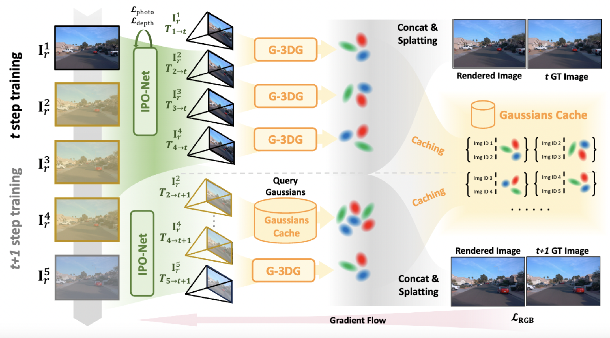

# GGRt: Towards Pose-free Generalizable 3D Gaussian Splatting in Real-time
### [[Project]](https://3d-aigc.github.io/GGRt/) [[Paper]](https://arxiv.org/abs/2403.10147) 

> [**VDG: Vision-Only Dynamic Gaussian for Driving Simulation**](https://arxiv.org/pdf/2403.10147.pdf),            

**Official implementation of "GGRt: Towards Pose-free Generalizable 3D Gaussian Splatting in Real-time".** 

## 🛠️ Pipeline

  

 

## Get started

Code Coming Soon~
